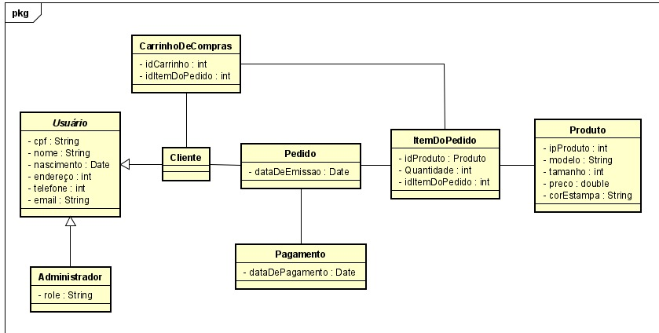

# Diagrama de Classes
## Versionamento
| Data | Versão | Descrição | Autor(es) |
|:----:|:------:|:---------:|:---------:|
| 06/11/2023 | 0.1 | Criação do documento | [Isabella Figueiredo](https://github.com/isabellafigueiredo) |

## Definição

&emsp;&emsp;O diagrama de classes no UML (Unified Modeling Language) é uma representação gráfica que descreve a estrutura de um sistema, destacando as classes que compõem o sistema, juntamente com seus atributos, métodos e as relações entre essas classes. Esse diagrama é uma ferramenta essencial na modelagem de sistemas orientados a objetos, permitindo aos desenvolvedores visualizar e organizar os componentes fundamentais do sistema, bem como suas interações, para uma compreensão mais clara e eficiente da arquitetura e do design do software.

## Diagrama de Classes

##### *Versão 0.1*

## Referências

1. Documentação de diagramas UML, Diagrama de Classes. Disponível em: [uml-diagrams.org](https://www.uml-diagrams.org/class-diagrams-overview.html). Acesso em: 06/11/2023.